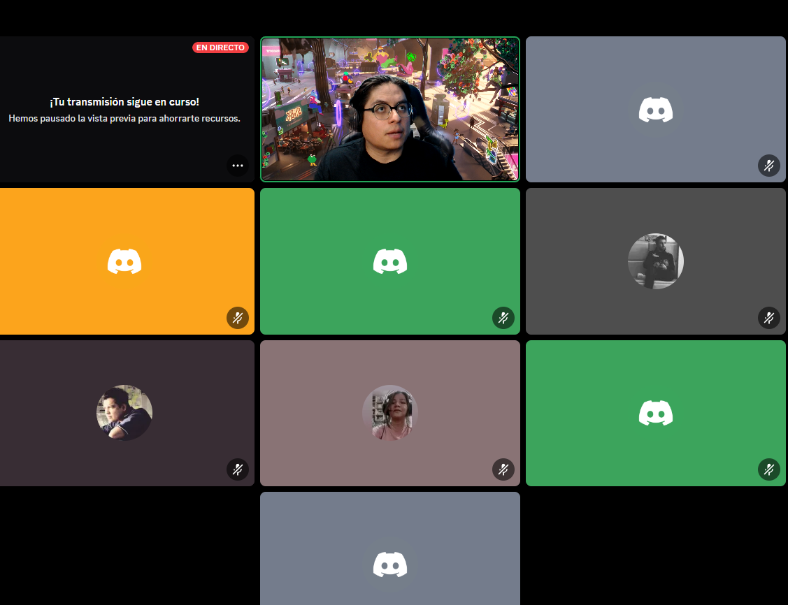
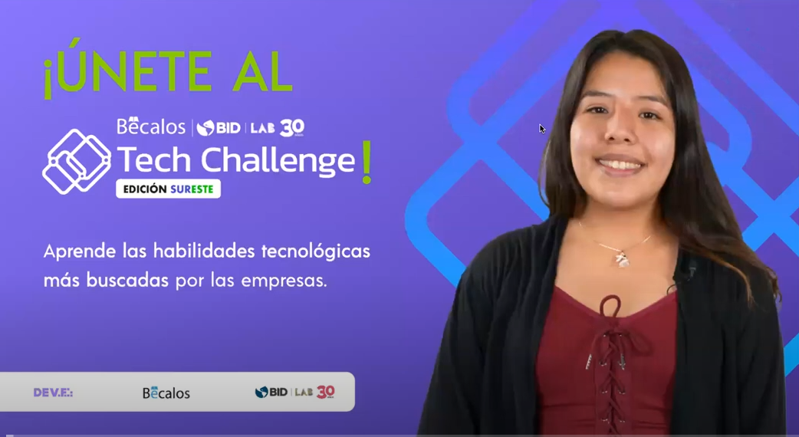

# Hola, mundo 🌐

## Sociales


## Lenguajes y herramientas favoritas: 🔩🔩 
- 

- - -


````javascript

const b = 10

````

- - - 

***Esto es divertido***

> Creando markdowns en Devf

<!-- links -->
[Ir al sitio](http://google.com)

<!-- alt: la informacion extra -->


- - -

### Mis repositorios más interesantes ⭐⭐⭐

- # [22 ideas para aprender](https://github.com/cchavezmx/3-WEB-PROTALENTO) 🧠


### Videos del curso Dojos 2023 - Mi perfil de Github
()

